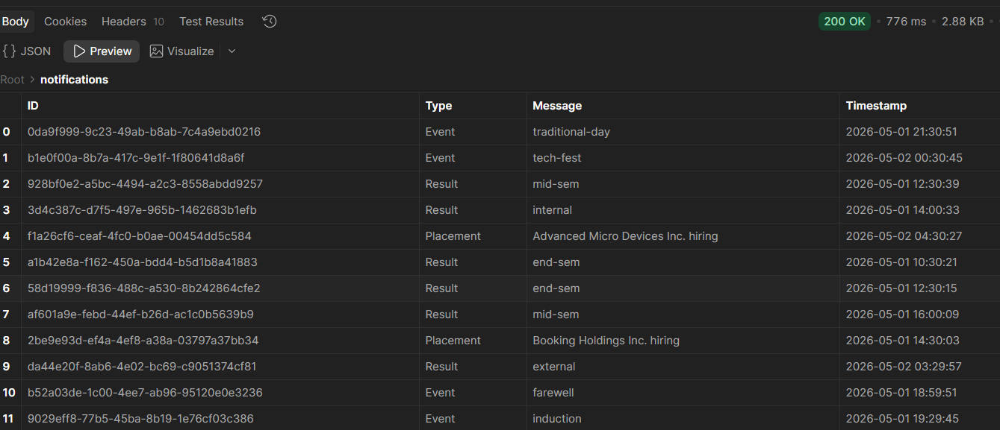

 Campus Notification & Vehicle Scheduler

This repository contains solutions for backend evaluation tasks.

 Implemented Features

* Vehicle Maintenance Scheduler using Knapsack Algorithm
* Logging Middleware structure
* Notification System Design (Stage 1 to Stage 6)
* API Integration using Postman

 API Testing

Successfully tested the following APIs:

* Registration API
* Auth Token API
* Depots API
* Vehicles API
* Notifications API

 Sample Output

Below is the response from Notifications API:

 Tech Used

* JavaScript (Node.js)
* Postman
* GitHub

All tasks are completed as per given instructions.
